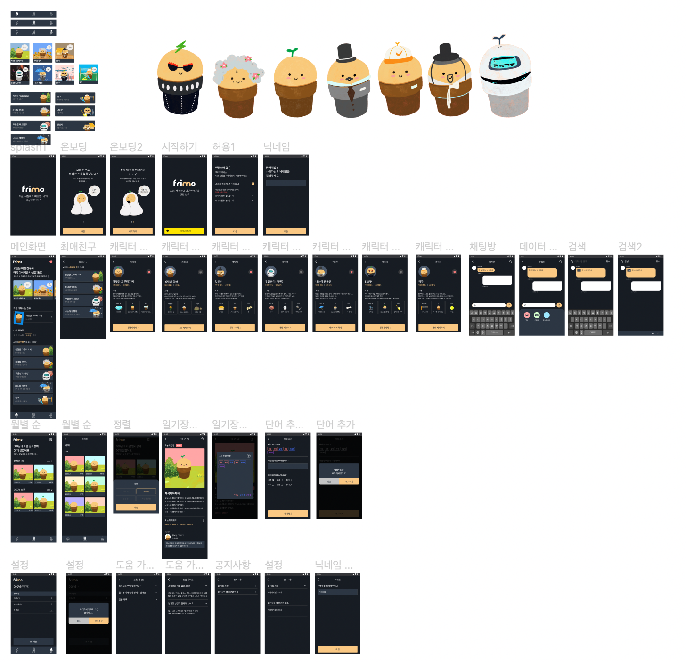
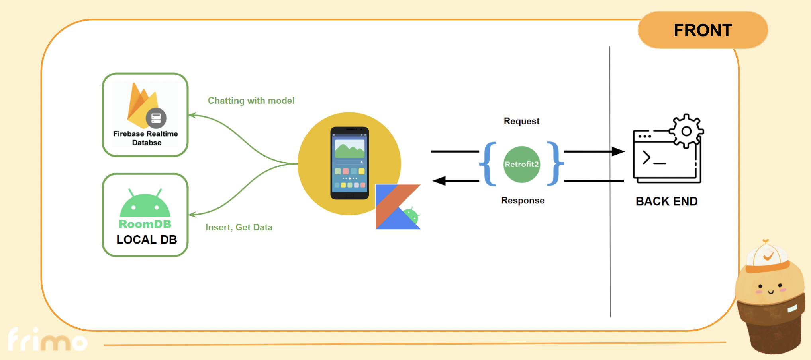

# FRIMO

## Design

## System Architecture

##Library List
- Firebase
- RoomDB
- Kapt(Kotlin annotation processing tool)
- Dots Indicator
- Flexbox Layout Manager
- Retrofit
- Gson
- Scalars
- Coroutine
- Lombok
- OKHttp

## Designer

> Kim min ji - gaemi1999

## Developer

> Kwon woo hyuk - Hongsi-Taste  
Nam seung hyeon - namsh1125  
Hyun do yeon - vivi108
> 

## Other

Information architecture - [https://docs.google.com/spreadsheets/d/1qR0I8NazPDy8tnL8rZ0Q72-mD4Tmk9gH_drqbuYF_BI/edit#gid=0](https://docs.google.com/spreadsheets/d/1qR0I8NazPDy8tnL8rZ0Q72-mD4Tmk9gH_drqbuYF_BI/edit#gid=0)

Flow chart - [https://drive.google.com/drive/folders/1rqrAbqnghGlmhEnjzwSIjw2io3UzLHzL](https://drive.google.com/drive/folders/1rqrAbqnghGlmhEnjzwSIjw2io3UzLHzL)

Design - [https://www.figma.com/file/uZOddT87X3kQ8Z2Ku4p5Z4/FRIMO_Design?node-id=0%3A1&t=mNBGOqbxFtWBQOfv-1](https://www.figma.com/file/uZOddT87X3kQ8Z2Ku4p5Z4/FRIMO_Design?node-id=0%3A1&t=mNBGOqbxFtWBQOfv-1)

Server - [https://github.com/Friend-for-Modern-people/FrimoServer](https://github.com/Friend-for-Modern-people/FrimoServer)

Model - [https://github.com/Friend-for-Modern-people/FRIMO_ML](https://github.com/Friend-for-Modern-people/FRIMO_ML)
